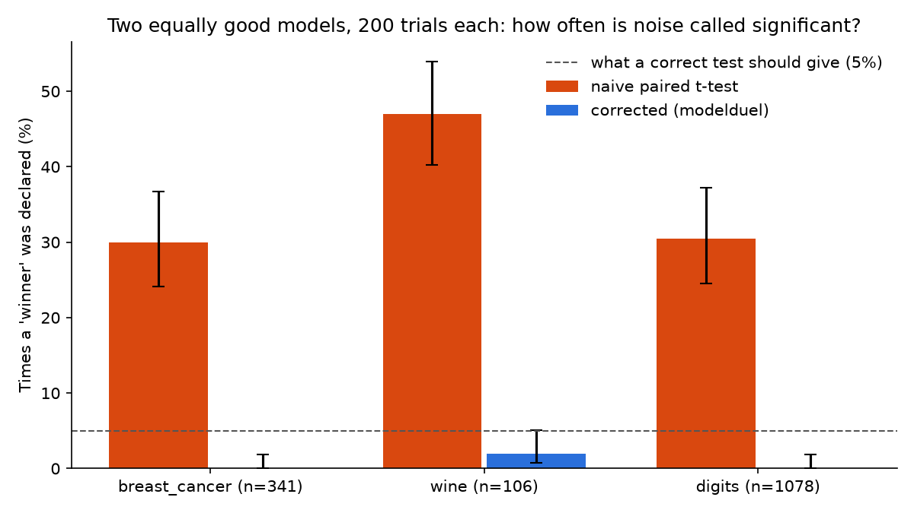

# modelduel

**Is model A really better than model B, or is it cross-validation noise?** One line, for any scikit-learn models.

[](https://github.com/shannantonysuresh/modelduel/actions/workflows/ci.yml)

```python
from modelduel import duel

print(duel(logistic_regression, random_forest, X, y))
```
```
A: 0.9772   B: 0.9596   (accuracy, 50 folds)
A - B = +0.0176  (95% CI -0.0001 to +0.0353),  corrected p = 0.0516
-> No significant difference: this gap is within cross-validation noise.
   (A naive t-test on the folds would say p = 2.04e-09: it ignores that folds share training data and overstates the evidence.)
```
*Real output: breast cancer dataset, scaled logistic regression vs. a default random forest.*

## The problem

The usual way to compare two models is to run cross-validation and do a paired t-test on the fold scores. That
test assumes the folds are independent. They aren't: any two folds share most of their training data. So it
underestimates the noise and **calls random differences "significant"**.

To measure how bad that is, I compared two decision trees that are **identical except for their random seed**
(so neither is truly better), 200 times per dataset on different random subsamples. A correct test at the 5% level
should be fooled about 5% of the time:



| Dataset | Naive paired t-test | modelduel (corrected) |
|---|---|---|
| breast_cancer (n=341) | **30.0%** (95% CI 24.1-36.7) | 0.0% (0.0-1.9) |
| wine (n=106) | **47.0%** (40.2-53.9) | 2.0% (0.8-5.0) |
| digits (n=1078) | **30.5%** (24.5-37.2) | 0.0% (0.0-1.9) |

The naive test declared a winner between equally good models in **30-47%** of trials. Reproduce it with
`python experiments/false_positives.py` (about a minute).

## What modelduel does

- Runs both models on the **same** repeated cross-validation splits (5 folds x 10 repeats by default),
  stratified for classifiers.
- Applies the **corrected resampled t-test** (Nadeau & Bengio, 2003), which inflates the variance by
  `1/k + n_test/n_train` to account for overlapping training sets.
- Returns the difference, a confidence interval, the p-value and a plain-English verdict. `result.winner` is
  `"A"`, `"B"` or `None`.

```python
r = duel(model_a, model_b, X, y, scoring="roc_auc", n_splits=5, n_repeats=10, alpha=0.05)
r.diff, r.ci_low, r.ci_high, r.p_value, r.winner
```
Any scikit-learn scorer works ("accuracy", "f1_macro", "roc_auc", "neg_mean_absolute_error", ...); higher is
always better. Defaults: accuracy for classifiers, R^2 for regressors.

## Honest caveats

- **The correction is conservative.** In the experiment it was fooled 0-2% of the time, not 5%. So it can miss
  small real differences: a "no significant difference" verdict means "not proven", not "proven equal".
- It is a heuristic correction, not an exact test. For a stricter alternative see the 5x2cv test (Dietterich, 1998).
- It compares two models on one dataset. Comparing many models, or across many datasets, needs a multiple-comparison method.

## Install

```bash
pip install git+https://github.com/shannantonysuresh/modelduel
```

## References

- C. Nadeau and Y. Bengio. *Inference for the Generalization Error.* Machine Learning, 52, 2003.
- R. Bouckaert and E. Frank. *Evaluating the Replicability of Significance Tests for Comparing Learning Algorithms.* PAKDD, 2004.
- T. Dietterich. *Approximate Statistical Tests for Comparing Supervised Classification Learning Algorithms.* Neural Computation, 1998.

MIT licensed.
